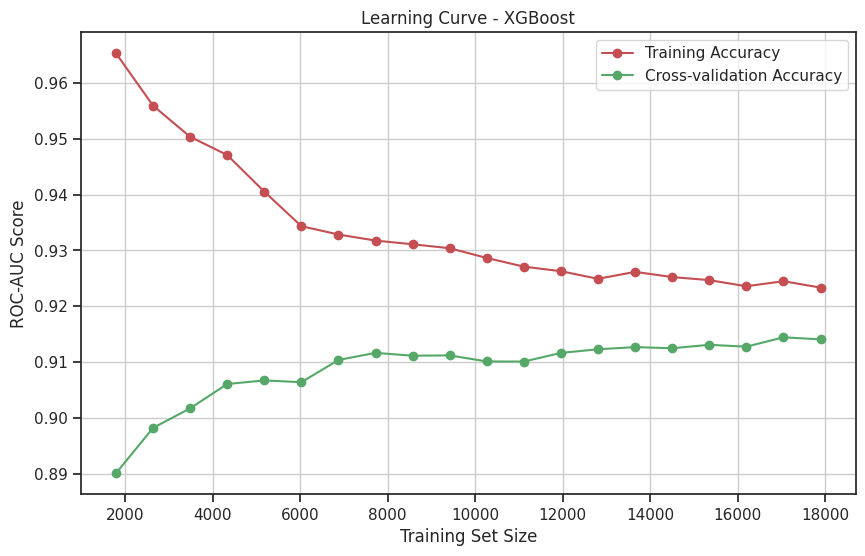
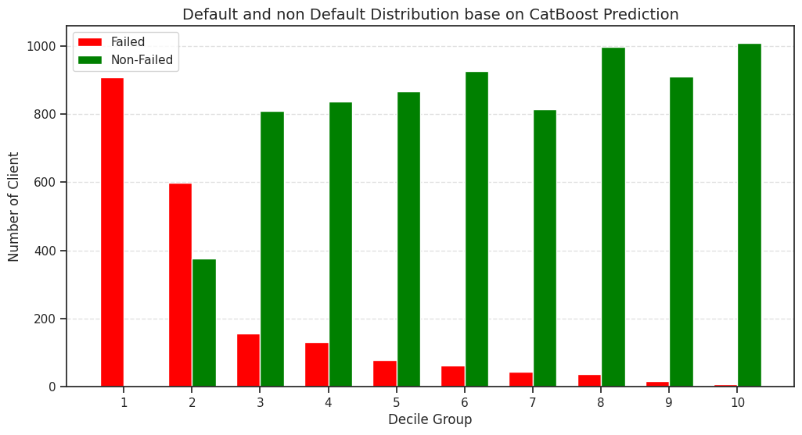
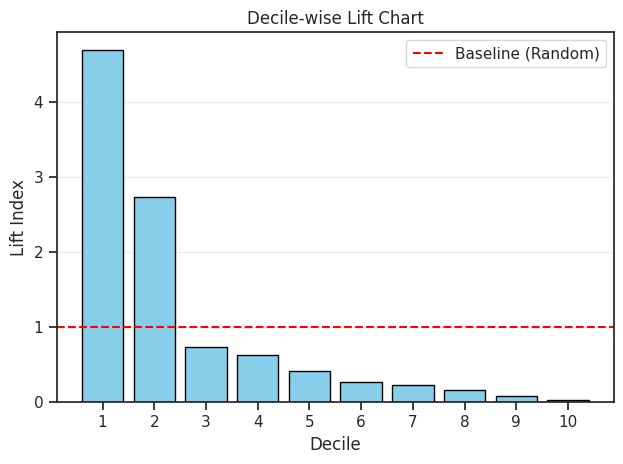
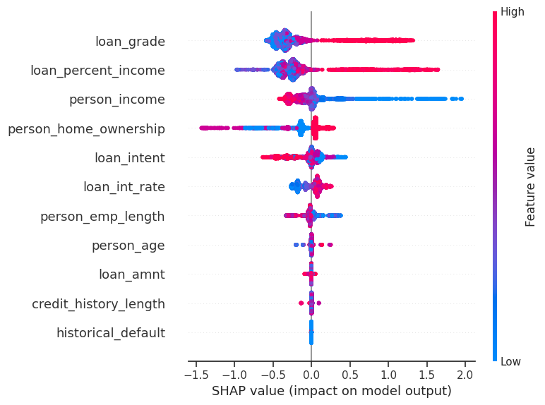

# Interpretable-Credit-Risk-Modeling-Using-Explainable-AI(XAI)-SHAP

## 📌 Project Overview
This project focuses on developing a robust Credit Scoring System using Machine Learning to identify high-risk borrowers. A key highlight of this work is the integration of Explainable AI (XAI) via **SHAP** (SHapley Additive exPlanations).

## 🛠️ Tech Stack
- Python (Pandas, NumPy, Scikit-Learn)
- Modeling: XGBoost, CatBoost, Random Forest, Balanced Random Forest.
- Interpretability: SHAP
- Visualization: Matplotlib, Seaborn

## 🚀 Key Features
- Optimal Model Selection: Selected XGBoost as the primary model based on learning curve analysis. It demonstrated superior generalization with minimal overfitting compared to other algorithms.
- Business Efficiency: Utilized a Decile-wise Lift Chart to demonstrate the model's power in prioritizing high-risk profiles.
- Automated Reason Codes: Implemented a system to generate automated reason for rejections based on local feature contributions, ensuring transparency for every applicant.
- Global & Local Interpretability: Leveraged both Global and Local SHAP analysis to pinpoint exactly which financial behaviors drive the risk of default.

## 📊 Analytics Highlights
### 1. Model Stability (Learning Curve)

Model showing close gap between training and cross-validation AUC-ROC score.
### 2. Business Impact (Lift Chart)

The model achieves a Lift Index of 4.5x in the 1st decile. Mathematically, this means the risk analyst team can be 4.5 times more effective at identifying potential defaulters by focusing only on the top 10% of high-risk applicants compared to random sampling.
### 3. Explainability (SHAP Summary)

SHAP reveals that a higher loan_percent_income and a loan_grade are the strongest predictors of default risk. Conversely, a higher person_income significantly acts as a protective factor, lowering the probability of default.

## 📝 Conclusion
This project moves beyond simple binary classification. By integrating SHAP, we provide the "Why" behind every decision. This capability is crucial for financial institutions to meet regulatory requirements.
